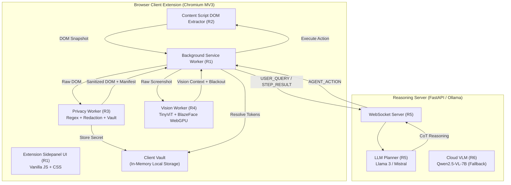

# PrivacyLens — System Architecture

## 1. High-Level System Overview



---

## 2. Technology Stack

| Tier | Component | Technology | Purpose |
| :--- | :--- | :--- | :--- |
| **Extension Client** | Architecture | Manifest V3 (MV3) | Modern, secure Chromium extension framework |
| | Frontend UI | Vanilla JS, Modern CSS (Design System) | Zero-dependency, lightweight, high performance |
| | DOM Extractor | Vanilla JS (`content.js`) | Traverses DOM, computes viewport bounding boxes |
| | Privacy Engine | Pure JavaScript Web Worker | Multi-tier PII regex, redaction maps, audit log |
| | Vision Worker | ONNX Runtime Web / WebGPU, OpenCV | TinyViT / MobileViT screen classification, BlazeFace |
| **Backend Server** | API / Transport | Python 3.11+, FastAPI, WebSockets | Async real-time bidirectional agent action loop |
| | LLM Planner | Ollama / Llama-3-8B-Instruct | Chain-of-Thought planning over sanitized DOM |
| | Vision Grounding | Qwen2.5-VL-7B (Ollama / HuggingFace) | Secondary coordinate grounding on redacted images |
| | Schema Contracts | JSON Schema draft-07, TypeScript types | Strict validation of inter-component payloads |

---

## 3. Directory & File Structure

```
Pecific/
├── docs/                                  # Project Documentation
│   ├── PRD.md                             # Requirements & user stories
│   ├── Architecture.md                    # Technical architecture & data flow
│   ├── Rules.md                           # AI & engineering guardrails
│   ├── Phases.md                          # Ordered development phases
│   ├── Design.md                          # Design system & tokens
│   ├── Memory.md                          # Running project memory log
│   ├── COMMUNICATION_SPEC.md              # WebSocket message contracts
│   └── iSIH_Build_Plan_6Person.md         # 6-person role assignment plan
├── extension/                             # Browser Extension (Client)
│   ├── manifest.json                      # MV3 Manifest
│   ├── background/                        # Background Service Worker
│   │   └── background.js                  # WebSocket orchestration & vault coordinator
│   ├── content/                           # Content Scripts
│   │   └── content.js                     # DOM snapshot extraction & action executor
│   ├── ui/                                # Sidepanel & Popup UI
│   │   ├── sidepanel.html                 # Main user interaction sidepanel
│   │   ├── sidepanel.css                  # Modern dark glassmorphic styling
│   │   └── sidepanel.js                   # State, privacy metrics, chat loop
│   └── workers/                           # Isolated Client Web Workers
│       ├── privacy-worker.js              # Privacy orchestrator worker
│       ├── regex.js                       # Multi-stage PII detection
│       ├── redaction.js                   # Token substitution & vault isolation
│       ├── ner.js                         # Contextual PII classifier
│       ├── ocr.js                         # Client OCR fallback
│       └── __tests__/                     # Privacy engine test suites
│           ├── regex.test.js              # 36 tests: PII regex verification
│           ├── redaction.test.js          # 13 tests: Tokenization & deduplication
│           ├── adversarial.test.js        # 15 tests: Injection & boundary tests
│           └── dom_redaction_server.test.js # 45 tests: DOM server contracts
├── schemas/                               # Shared Frozen Protocol Contracts
│   ├── dom_snapshot.schema.json           # Content script → Privacy worker
│   ├── redacted_payload.schema.json       # Privacy worker → Server payload
│   ├── vision_context.schema.json         # Vision worker → Server payload
│   ├── action.schema.json                 # Server planner → Extension executor
│   ├── vault_manifest.schema.json         # Extension client vault presence
│   └── agent_message.schema.ts            # WebSocket protocol catalog
├── server/                                # Backend Reasoning Server
│   ├── app.py                             # FastAPI & WebSocket entrypoint
│   ├── planner.py                         # LLM agent CoT prompt & planner
│   ├── vlm.py                             # Secondary VLM coordinate grounding
│   └── requirements.txt                   # Server dependencies
├── fixtures/                              # Test Benchmarks & Harness
│   ├── screenshots/                       # Raw & benchmark screenshot files
│   │   ├── redacted/                      # Redacted outputs & server payloads
│   │   └── *.png, *.json                  # Screenshot fixtures
│   └── screenshot_test_harness.html       # Interactive Before/After test harness
├── scripts/                               # Developer Tooling & Verification
│   ├── build_real_screenshot_doms.py      # DOM fixture generator
│   ├── scan_and_redact_screenshots.js     # Redaction runner pipeline
│   ├── redact_image_helper.py             # OpenCV image blackout helper
│   └── generate_benchmark_screenshots.py  # Synthetic benchmark creator
└── package.json                           # Node.js project definition
```

---

## 4. End-to-End Data Flow

1. **Trigger:** User sends a query (e.g., *"Apply for the internship on this portal"*).
2. **Capture:** `content.js` captures current interactive DOM tree; `chrome.tabs.captureVisibleTab` takes a raw viewport screenshot.
3. **Local Privacy Scan:** `privacy-worker.js` scans DOM element text and `<input value="...">` attributes. Sensitive fields are substituted with tokens (`[EMAIL_1]`, `[PASSWORD_FIELD]`). The plaintext values are recorded in the client vault.
4. **Local Visual Blackout:** `vision-worker.js` / OpenCV helper detects faces, user avatars, and maps DOM coordinates of redacted elements to image space. Solid black `#000000` rectangles are drawn over them.
5. **Egress Payload:** Extension sends `USER_QUERY` message containing:
   - `sanitized_dom`: 100% structurally identical DOM with masked tokens.
   - `redacted_screenshot`: Image with blacked-out faces, avatars, and credentials.
   - `token_manifest`: Typed semantic mappings (e.g., `[EMAIL_1]` is `EMAIL`).
   - `vision_context`: `screen_type` classification and visual layout.
6. **Reasoning:** Server LLM / VLM plans next browser action (e.g. `fill("input#username", "[EMAIL_1]")`).
7. **Action Execution:** Extension receives `AGENT_ACTION`. If the target value is a token (`[EMAIL_1]`), the extension resolves it via the local in-memory client vault to the real secret before typing it into the page.
