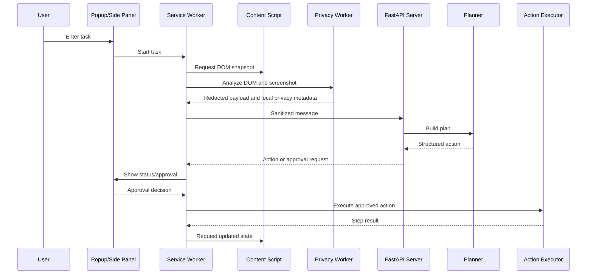

# System Architecture

## Overview

The system has two trust zones:

1. **Client trust zone:** a Chrome Manifest V3 extension that reads pages, detects PII, owns credentials, executes actions, and decides what may leave the device.
2. **Server reasoning zone:** a Python service that receives only sanitized context, plans actions, performs visual reasoning on redacted images, and manages non-sensitive task state.

The server must never be treated as a credential store or as the source of truth for raw page data.

## App Flow



## Folder And File Structure

```text
extension/
  manifest.json                 MV3 permissions and entry points
  service-worker.js             Orchestration and client/server messaging
  popup/                        Short-lived task UI
  sidepanel/                    Persistent task UI
  content/
    content-script.js           Page bridge and task-tab interaction
    content-script-stub.js      Development content-script entry point
    dom-extractor.js            Semantic DOM extraction
    action-executor.js          Structured action execution
  workers/
    privacy-worker.js           Local PII pipeline coordinator
    regex.js                    Deterministic PII detection
    ner.js                      Local NER integration
    ocr.js                      Local OCR integration
    redaction.js                Redaction and map generation
    vision-worker.js            Local visual analysis
  vault/vault-manager.js        Encrypted local credential handling
  tab/tab-manager.js            Agent-tab registration and isolation
  lib/ort/                      ONNX Runtime Web assets
  fixtures/                     Client-side contract and model fixtures
server/
  main.py                       FastAPI application entry point
  config.py                     Runtime and model configuration
  api/                          HTTP and WebSocket handlers
  core/                         Planning, protocol, and correction logic
  models/                       LLM and VLM loaders
  schemas/                      Server-side message and action models
  state/                        Session, memory, and task state
  vision/                       Visual grounding and verification
schemas/                         Shared client/server contracts
ort-fetch/                       ONNX Runtime asset preparation utility
docs/                            Product and engineering documentation
```

## Technology Stack

- Browser: Chrome Manifest V3 JavaScript, Web Workers, Web Crypto API, and WebGPU where available.
- Client ML: ONNX Runtime Web, Transformers.js-compatible local models, Tesseract.js-compatible OCR, and a local face detector.
- Server: Python 3.11+, FastAPI, WebSocket, and Pydantic-style schemas.
- Planning model: Qwen3-14B, quantized for the target development GPU where available.
- Visual model: Qwen2.5-VL-7B-Instruct, quantized for the target development GPU where available.
- Development deployment: local server or Colab plus ngrok during the demo stage.
- State: local browser storage/vault on the client; SQLite or JSON-backed session state on the server during development.

## Data Flow

1. The content script extracts only the semantic and interactive page context needed for planning.
2. The vision worker captures and analyzes a page image locally.
3. The privacy worker applies regex, NER, OCR, face detection, and redaction.
4. The service worker validates a `redacted_payload` and sends it over the API/WebSocket.
5. The server validates the envelope, updates the session, and asks the planner for a structured action.
6. Visual verification is requested only with sanitized visual context.
7. The extension validates the action, asks for approval when required, executes it, and reports a `STEP_RESULT`.
8. The loop repeats until completion, cancellation, or an unrecoverable error.

## Shared Contracts

The contracts in `schemas/` are the integration boundary:

- `dom_snapshot.schema.json`: sanitized semantic page representation.
- `vision_context.schema.json`: screen state, confidence, and detected regions.
- `redacted_payload.schema.json`: sanitized DOM, image metadata, and client-only redaction references.
- `agent_message.schema.ts`: WebSocket message envelope and event types.
- `action.schema.json`: allowed structured actions and safety metadata.
- `vault_manifest.schema.json`: key presence and field capability without secret values.

Contract changes require review from both extension and server owners.

## APIs

### HTTP

- `GET /health`: service liveness and model readiness summary.
- `POST /sessions`: create a non-sensitive task session.
- `GET /sessions/{session_id}`: retrieve sanitized task status.
- `POST /sessions/{session_id}/cancel`: request cancellation.

### WebSocket

- `WS /ws/{session_id}`: bidirectional task protocol.
- Client events include task start, sanitized context, approval decision, and step result.
- Server events include plan/action, approval required, progress, completion, and error.
- Exact fields belong in the shared message schema; handlers must reject unknown or invalid action types.

## Key Dependencies

- Browser-side ONNX Runtime Web assets are checked in under `extension/lib/ort/`.
- Client model and OCR dependencies must run locally and off the main UI thread where practical.
- Server dependencies belong in `server/requirements.txt` and must be pinned or version-reviewed before reproducible installation is claimed.
- Model loading must be isolated behind `server/models/llm_loader.py` and `server/models/vlm_loader.py` so tests can use deterministic fakes.

## Reliability Boundaries

- If local sanitization fails, fail closed and do not send the payload.
- If the server is unavailable, preserve local task state and show a recoverable error.
- If an action cannot be verified, stop or request a new plan instead of blindly repeating it.
- If a model is unavailable, use the documented fallback or report that capability as unavailable.
