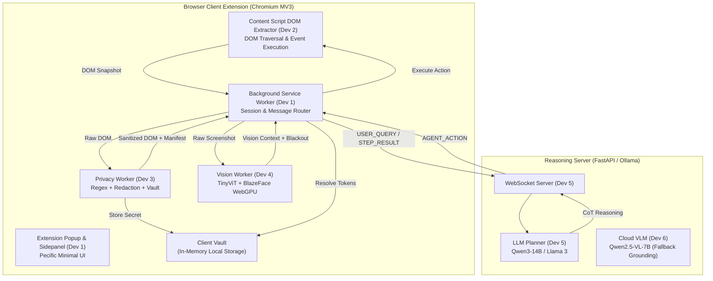

# PrivacyLens (Pecific) — System Architecture

## 1. High-Level System Overview



---

## 2. Technology Stack

| Tier | Component | Technology | Purpose |
| :--- | :--- | :--- | :--- |
| **Extension Client** | Architecture | Chrome Manifest V3 (MV3) | Modern, secure Chromium extension framework |
| | Frontend UI | Vanilla JS, Modern CSS (Pecific Design) | Zero-dependency, lightweight, high performance |
| | DOM Extractor | Vanilla JS (`content.js`) | Traverses DOM, computes viewport bounding boxes |
| | Privacy Engine | Pure JavaScript Web Worker | Multi-tier PII regex, redaction maps, audit log |
| | Vision Worker | ONNX Runtime Web / WebGPU, OpenCV | TinyViT screen classification, BlazeFace |
| **Backend Server** | API / Transport | Python 3.11+, FastAPI, WebSockets | Async real-time bidirectional agent action loop |
| | LLM Planner | Qwen3-14B / Llama-3-8B-Instruct | Chain-of-Thought planning over sanitized DOM |
| | Vision Grounding | Qwen2.5-VL-7B (Ollama / HuggingFace) | Secondary coordinate grounding on redacted images |
| | Schema Contracts | JSON Schema draft-07, TypeScript types | Strict validation of inter-component payloads |

---

## 3. Directory & File Structure

The project is structured as a modular repository with clear ownership per role:

```
Pecific/
├── docs/                                  # Project Documentation
│   ├── PRD.md                             # Requirements & user stories
│   ├── Architecture.md                    # Technical architecture & data flow
│   ├── Rules.md                           # AI & engineering guardrails
│   ├── Phases.md                          # Ordered development phases
│   ├── Design.md                          # Design system & tokens (Pecific Light & Dark)
│   ├── Memory.md                          # Running project memory log
│   ├── COMMUNICATION_SPEC.md              # WebSocket message contracts
│   └── iSIH_Build_Plan_6Person.md         # 6-person role assignment plan
├── extension/                             # Browser Extension (Client)
│   ├── manifest.json                      # MV3 Manifest (Dev 1)
│   ├── popup/                             # Extension Action Popup (Dev 1)
│   │   ├── index.html                     # Popup layout
│   │   └── popup.js                       # Popup controller & state sync
│   ├── sidepanel/                         # Main Agent Interaction Sidepanel (Dev 1)
│   │   └── index.html                     # Chat feed, approval dialog, plan timeline
│   ├── service-worker.js                  # Background Service Worker & Router (Dev 1)
│   ├── content/                           # Content Scripts (Dev 2)
│   │   └── content.js                     # DOM snapshot extraction & action executor
│   └── workers/                           # Isolated Client Web Workers (Dev 3 & Dev 4)
│       ├── privacy-worker.js              # Privacy orchestrator worker (Dev 3)
│       ├── regex.js                       # Multi-stage PII detection (Dev 3)
│       ├── redaction.js                   # Token substitution & vault isolation (Dev 3)
│       ├── ner.js                         # Contextual PII classifier (Dev 3)
│       ├── ocr.js                         # Client OCR fallback (Dev 3)
│       ├── vision-worker.js               # Vision perception worker (Dev 4)
│       └── __tests__/                     # Privacy engine test suites (Dev 3)
│           ├── regex.test.js              # 36 tests: PII regex verification
│           ├── redaction.test.js          # 13 tests: Tokenization & deduplication
│           ├── adversarial.test.js        # 15 tests: Injection & boundary tests
│           └── dom_redaction_server.test.js # 45 tests: DOM server contracts
├── schemas/                               # Shared Frozen Protocol Contracts
│   ├── dom_snapshot.schema.json           # Dev 2 (Content script) → Dev 3 (Privacy worker)
│   ├── redacted_payload.schema.json       # Dev 3 (Privacy worker) → Dev 5 (Server)
│   ├── vision_context.schema.json         # Dev 4 (Vision worker) → Dev 5 (Server)
│   ├── action.schema.json                 # Dev 5 (Server planner) → Dev 2 (Executor)
│   ├── vault_manifest.schema.json         # Dev 3 (Client vault) presence
│   └── agent_message.schema.ts            # Shared WebSocket protocol catalog
├── server/                                # Backend Reasoning Server (Dev 5 & Dev 6)
│   ├── app.py / main.py                   # FastAPI & WebSocket entrypoint
│   ├── planner.py                         # LLM agent CoT prompt & planner (Dev 5)
│   ├── vision/ / vlm.py                   # Secondary VLM coordinate grounding (Dev 6)
│   └── requirements.txt                   # Server dependencies
├── fixtures/                              # Test Benchmarks & Schemas
│   ├── dom_clean.json                     # Clean e-commerce DOM fixture
│   ├── dom_with_pii.json                  # PII-rich DOM fixture
│   ├── pii_test_strings.json              # Adversarial test strings
│   └── redacted_payload_sample.json       # Sample egress payload
├── scripts/                               # Developer Tooling & Verification
│   ├── redact_image_helper.py             # OpenCV image blackout helper
│   └── vision_processor.py                # On-device screen classifier simulation
└── package.json                           # Node.js project definition & test runners
```

---

## 4. End-to-End Execution Loop (Pipeline)

The system executes a repeating step-by-step pipeline for autonomous action:
1. **Trigger:** User sends a query (e.g. *"Buy headphones under ₹1000 on Flipkart"*).
2. **Capture DOM & Screenshot:** `content.js` captures current interactive DOM tree; `chrome.tabs.captureVisibleTab` takes a raw viewport screenshot.
3. **On-Device Vision:** `vision-worker.js` classifies the screen (`search_results`, `checkout_cart`, `login_auth`) and detects faces/avatars.
4. **On-Device Privacy Engine:** `privacy-worker.js` runs Regex + DOM heuristics + NER/OCR fallback on DOM nodes. Sensitive fields are substituted with tokens (`[EMAIL_1]`, `[PASSWORD_FIELD]`, `[CARD_1]`). Raw secrets are saved in the client-only in-memory vault.
5. **Visual Blackout:** Black rectangles (`#000000`) are drawn over faces, avatars, and DOM coordinate boxes on the screenshot.
6. **Send to Server (WebSocket):** Extension dispatches `USER_QUERY` or `STEP_RESULT` with `sanitized_dom`, `redacted_screenshot`, `token_manifest`, and `vision_context`. Zero plain PII exits the browser.
7. **LLM Planning & VLM Verification:** Server LLM generates the next action step. If confidence is borderline, VLM verifies the coordinate target against the redacted screenshot.
8. **Action Response:** Server responds with `NEXT_STEP` or `APPROVAL_REQUIRED` (for checkout/login).
9. **Execution & Vault Resolution:** Extension receives the action. If it contains a token (e.g. `[EMAIL_1]`), the extension resolves it locally from the client vault before typing.
10. **Repeat:** The loop advances until `TASK_COMPLETE`.
